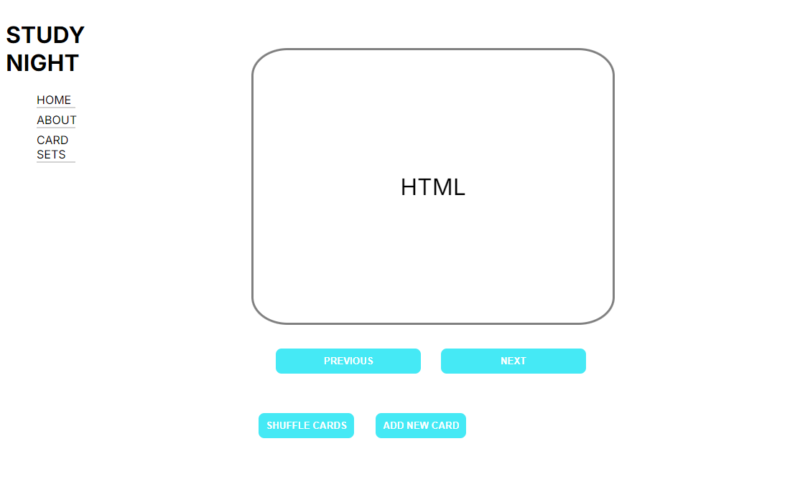

# Study Night

[](https://github.com/Soodabug/study-night-flashcards/actions/workflows/ci.yml)

A flashcards app: make study sets, add cards, flip through them, shuffle.

Try it: https://soodabug.github.io/study-night-flashcards/



## About this project

It started as the testing and optimization project of the Udacity Front End JavaScript course. The course gave me a working but untested app. My job was to make it something you can trust and ship, so most of my work is around the app, not the look of it:

- end-to-end tests with Cypress and unit tests with Mocha and Chai
- ESLint and Prettier
- a build with Parcel, and Gulp tasks for the common jobs
- a GitHub Actions workflow that lints, tests and builds every push, and publishes the site only when everything passed

After the course I kept going and added a few things of my own:

- sets and cards are saved in the browser, so they survive a reload
- cards flip on click and with the keyboard (before, only on hover, which does not work on phones)
- fixed a bug I found while writing tests: a card added after shuffling was lost
- smaller images (the home image went from 1.4 MB to 85 KB)

## Run it

You need Node 22 or newer.

```bash
npm install
npm start        # http://localhost:1234
```

## Tests

```bash
npm run lint     # ESLint
npm test         # unit tests
npm run e2e      # starts the app and runs the Cypress tests
```

If the app is already running you can use `npm run cypress`, or `npm run cypress:open` to watch the tests in a browser.

What is tested:

| File                            | What it checks                                                       |
| ------------------------------- | -------------------------------------------------------------------- |
| `test/shuffle.js`               | shuffle keeps all items and does not change its input                |
| `test/storage.js`               | saving and loading sets, broken or blocked storage                   |
| `cypress/e2e/navigation.cy.js`  | the three pages open from the menu                                   |
| `cypress/e2e/form.cy.js`        | creating a set, empty title shows an error                           |
| `cypress/e2e/cards.cy.js`       | showing, flipping, next/previous, adding cards, form errors, shuffle |
| `cypress/e2e/persistence.cy.js` | sets and cards are still there after a reload                        |

## Build

```bash
npm run build    # output in dist/
```

`npx gulp check` runs lint, unit tests, end-to-end tests and the build in one go.

## Folders

```
app/            the app (index.html, src, styles, data, images)
test/           unit tests
cypress/e2e/    end-to-end tests
.github/        CI and deploy workflow
```

## Things I would do next

- delete and rename sets and cards
- make the menu real links, so it works with the keyboard and the back button
- a "reset to sample sets" button

## Credits

App starter code and design: Udacity (see `LICENSE.txt`). Image credits are in `app/images/imageCitations.md`.
